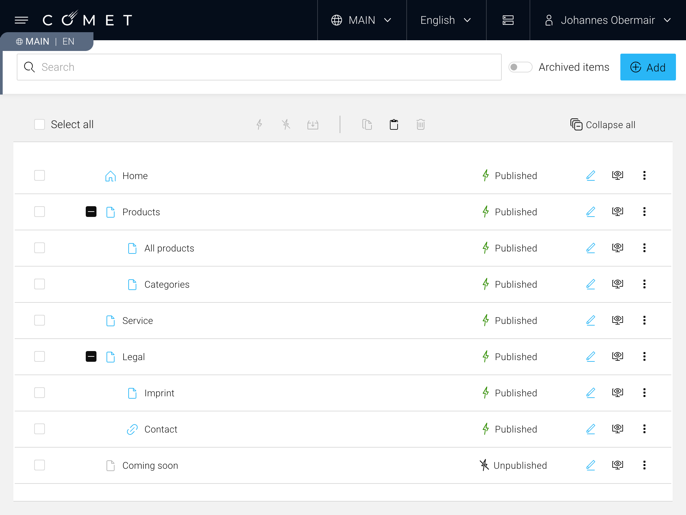
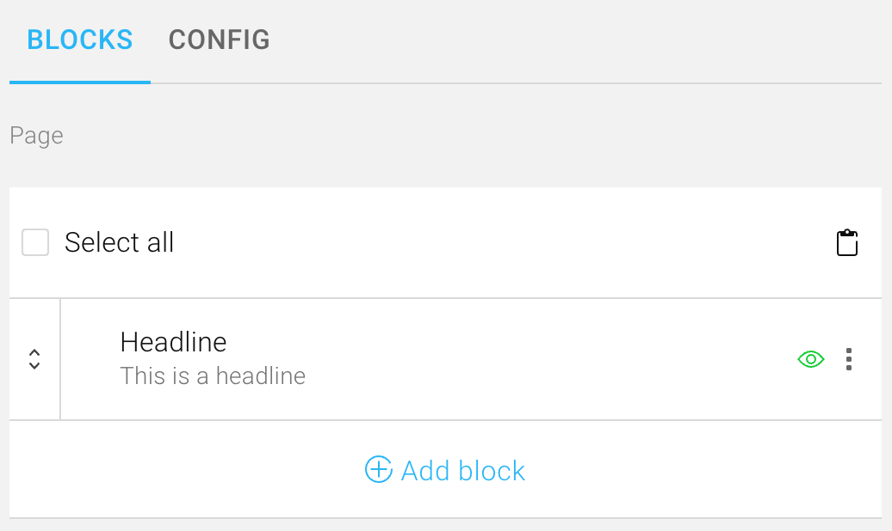
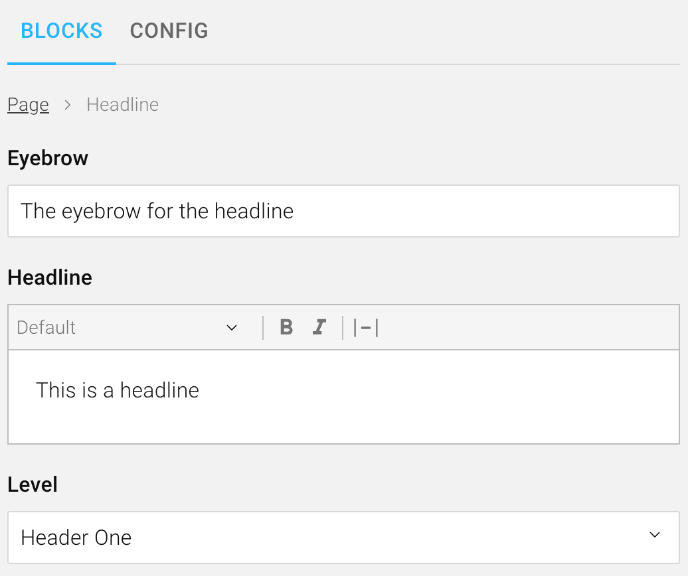
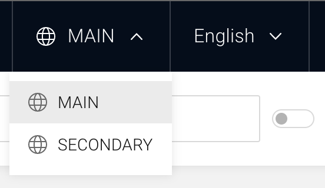

On this page, you’ll learn the core concepts of COMET DXP. These concepts represent the essential building blocks when developing COMET DXP applications. List the status of all processes:

## Page tree

*Page tree of a typical COMET DXP application*

The page tree is the main entry point for a COMET DXP application. It represents the hierarchy of the application. The tree has multiple nodes and child nodes. Typically, the page tree hierarchy is used to create the main navigation of the page.

Each node has a **slug** (sometimes referred to as the “URL part”), which is unique for the level in which the node resides. The slug is used to construct the **path** of a page tree node. For instance, the “All products” page tree node in the example above may have the slug “all-products.” Combined with the slug “products” of the parent page tree, node “Products” results in the path “/products/all-products.”

*Slug and path of a page tree node*

## Documents

Documents hold the content of a COMET DXP application. A document usually contains multiple fields and (root) blocks.
Documents are organized by document types. A COMET DXP application usually supports at least two different document types: **Page**, for content pages, and **Link**, for linking to internal pages or external links. However, it may also support additional document types, for instance, a document type for a raffle.

Documents can be attached to nodes in the page tree. Multiple documents can be attached to the same page tree node. This can be convenient when the document type of a page tree node changes (e.g., a page becomes a link), as the content of the original page, is still available and can be accessed at a later point.

*Document type select for a page tree node*

## Blocks
Blocks represent the smallest unit in a COMET DXP application and are used for unstructured content created by content editors (often called “dumb” content). Multiple blocks can be composed in a tree-like structure to represent parts (or a whole page) of content.
Blocks at the root of a document are commonly referred to as **root blocks**. Root blocks offer additional functionality, such as creating an index of paths for their child blocks.

A document typically holds at least one block, the **content block**. However, a document may have additional blocks, such as stage or SEO blocks.

*Content block of a document*

*A headline block*

## Content scope

Content in a COMET DXP application is usually scoped to a specific domain, for instance, per website or language. This feature is called content scope. Some parts of the application, such as the page tree, are always scoped, as they must be maintained separately. Other parts of the application, such as products retrieved from an external data source, may be used across multiple scopes. These parts should be stored in the global content scope (= no scope).
Using a scope for specific content introduces additional complexity to the whole application. A content’s scope has to be taken into consideration at all times when accessing the content. Therefore, the use of a content scope should be well considered. Generally speaking, a content scope should not be added prematurely but only when needed.

*Content scope select*